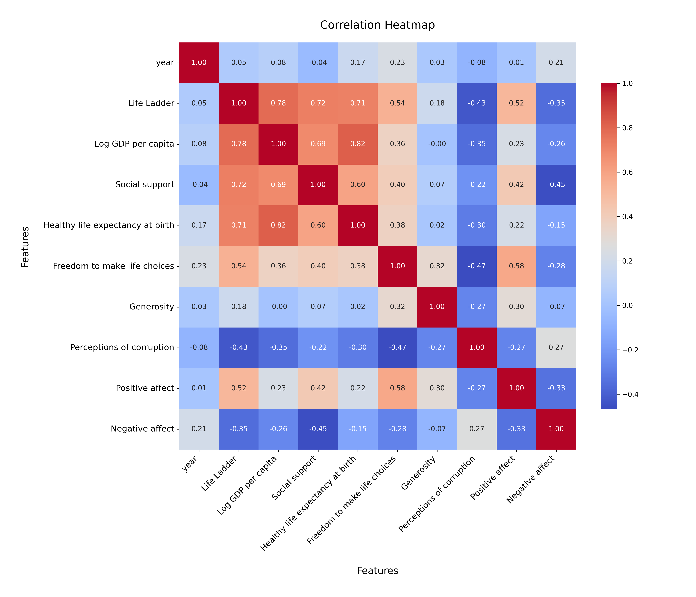
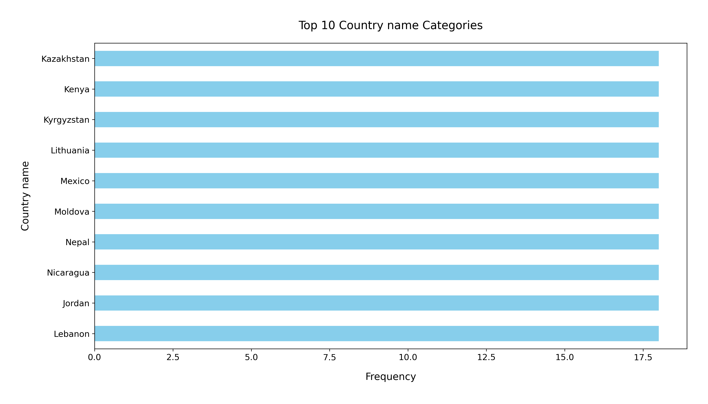

# Analysis Report

### Summary of the Dataset

The dataset from `happiness.csv` contains 2,363 rows and 11 columns, with information regarding various factors contributing to happiness across different countries from the years 2005 to 2023. The columns include metrics such as the Life Ladder (a measure of overall life satisfaction), Log GDP per capita, Social support, Healthy life expectancy at birth, Freedom to make life choices, Generosity, Perceptions of corruption, and emotional well-being metrics (Positive and Negative affect). 

### Key Insights

1. **Missing Values**: 
   - Several columns have missing values, with the most significant gaps in the 'Generosity' (81 missing), 'Perceptions of corruption' (125 missing), and 'Healthy life expectancy at birth' (63 missing) fields. This could impact analyses involving these variables.

2. **Life Ladder**: 
   - The average Life Ladder score is approximately 5.48, indicating a moderate level of life satisfaction across the countries analyzed. The scores range from 1.281 to 8.019, suggesting a significant disparity between the least and most satisfied populations.

3. **Economic Indicators**:
   - The mean Log GDP per capita is around 9.40, revealing a correlation between economic indicators and happiness. Countries with higher GDP per capita generally report higher happiness levels, as indicated by the positive correlation between the Life Ladder and Log GDP.

4. **Social Support**:
   - The average score for Social Support is 0.81, indicating that social connections play a crucial role in overall happiness. Areas with lower social support may need interventions to strengthen community ties.

5. **Freedom to Make Life Choices**:
   - With an average score of approximately 0.75, this metric is vital for happiness. Countries with higher freedom scores tend to report higher life satisfaction levels.

6. **Affective Measures**:
   - Positive affect averages around 0.65, while Negative affect averages 0.27, suggesting that generally, people experience more positive emotions than negative ones. This balance is crucial for overall happiness.

### Recommendations

1. **Address Missing Data**:
   - Implement strategies to handle missing values, such as imputation or collecting additional data, particularly in the 'Generosity' and 'Perceptions of corruption' columns.

2. **Focus on Economic Growth**:
   - Policies aimed at increasing GDP per capita can be beneficial. This could involve investments in job creation, education, and infrastructure.

3. **Enhance Social Support Systems**:
   - Encourage community-building initiatives and support systems that foster relationships among residents. This could include mental health programs, community centers, and volunteer opportunities.

4. **Promote Freedom and Autonomy**:
   - Governments should consider policies that enhance individual freedoms and choices, as these are closely linked to happiness levels.

5. **Monitor Emotional Well-being**:
   - Regularly assess emotional well-being in populations, focusing on strategies that promote positive affect and mitigate negative affect.

In summary, the dataset highlights significant relationships between economic factors, social support, and happiness indicators. By addressing the identified gaps and focusing on enhancing these key areas, countries can work towards improving the overall happiness of their populations.

