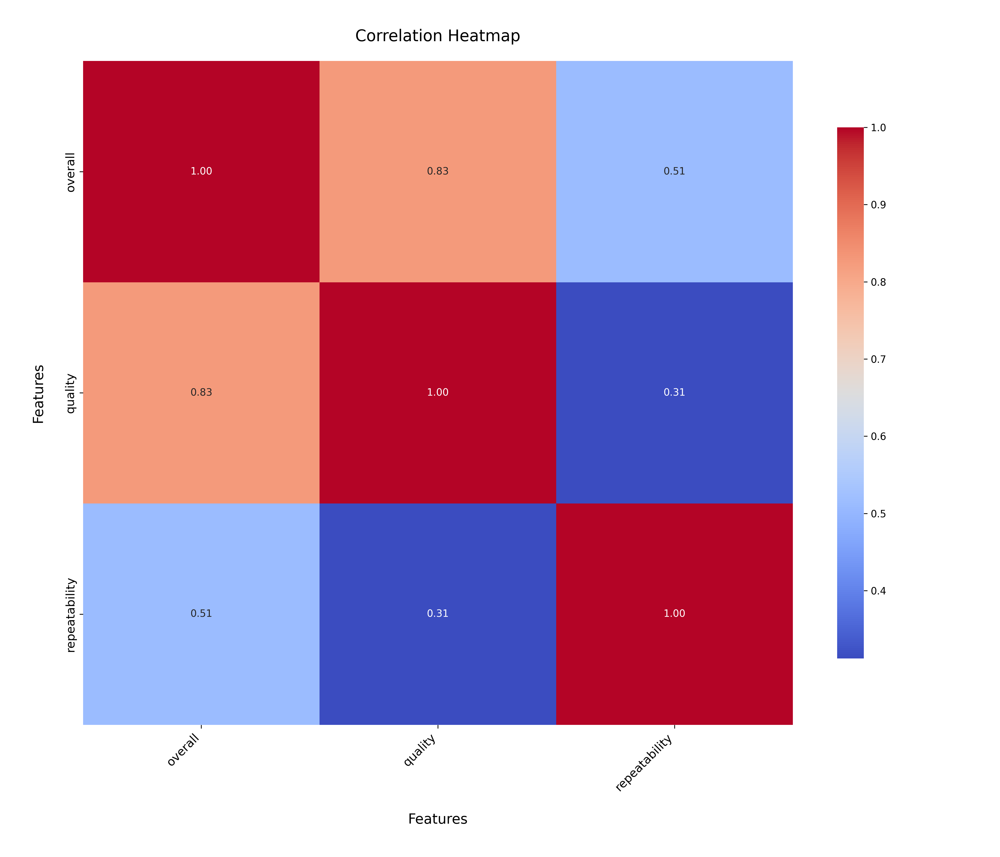
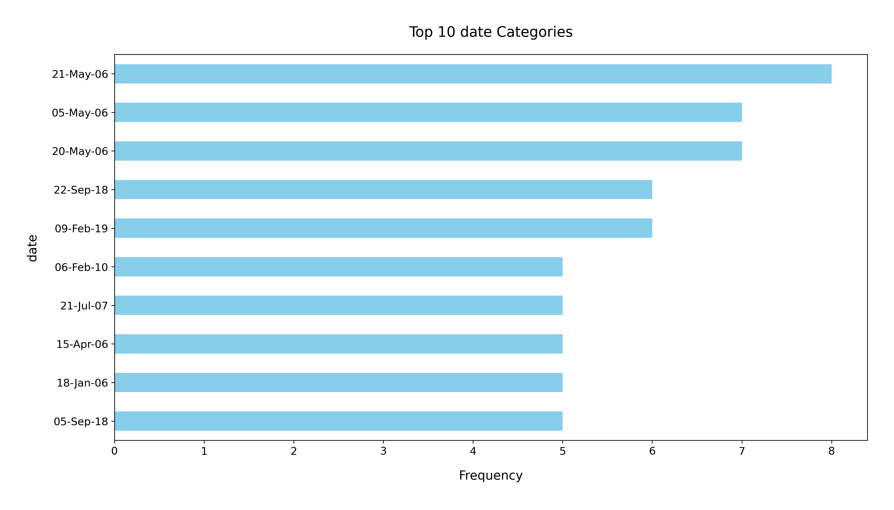

# Analysis Report

### Dataset Summary

The dataset titled `media.csv` contains 2,652 records and 8 columns, providing insights into various media titles. The columns include:

- **date**: The release date of the media.
- **language**: The language of the media.
- **type**: The category of media (e.g., movie, show).
- **title**: The name of the media.
- **by**: The creator or producer of the media.
- **overall**: A rating score for the media (1 to 5).
- **quality**: A quality assessment score (1 to 5).
- **repeatability**: A score indicating how often the media can be re-watched or re-consumed (1 to 3).

### Key Insights

1. **Missing Values**: 
   - The dataset has 99 missing values in the `date` column and 262 missing values in the `by` column. Other columns have no missing values. This suggests that a significant amount of information about the creators of the media is not available, which could limit certain analyses.
  
2. **Language Distribution**:
   - The dataset includes 11 unique languages, with English being the most prevalent, appearing in 1,306 records. This indicates a strong representation of English-language media.

3. **Type of Media**:
   - A significant majority (2,211 entries) are categorized as movies, which may skew analyses focused on media type. This dominance suggests a potential area for deeper exploration into non-movie types.

4. **Rating Statistics**:
   - The `overall` ratings have a mean of approximately 3.05, with a standard deviation of 0.76, indicating a generally favorable reception but with variability. 
   - The `quality` mean score is slightly higher at approximately 3.21, suggesting that viewers perceive the quality of media to be better than the overall enjoyment.
   - The `repeatability` score has a mean of roughly 1.49, indicating that most media is not frequently re-watched, with a concentration at the lower end of the scale (1.0).

5. **Popular Titles and Creators**:
   - The title "Kanda Naal Mudhal" has the highest frequency (9 occurrences), while "Kiefer Sutherland" is noted as a prominent creator, appearing 48 times. This suggests that certain titles and creators have a considerable impact on the dataset.

### Recommendations

1. **Handling Missing Values**: 
   - Address the missing values in the `date` and `by` columns through imputation or analysis of patterns to understand if certain types of media are more likely to have missing data in these columns.

2. **Exploration of Non-Movie Media**:
   - Given the dominance of movies, it would be beneficial to conduct a more in-depth analysis of the non-movie entries to understand their characteristics and potential audience engagement.

3. **Viewer Preferences and Ratings**:
   - Further analysis should be conducted to explore the relationship between `overall`, `quality`, and `repeatability` scores. This could help identify what aspects of media contribute most to viewer satisfaction and re-watch likelihood.

4. **Cultural Diversity**:
   - Since the dataset covers multiple languages, it may be worthwhile to investigate the performance and reception of media across different languages to identify trends and preferences among diverse audiences.

5. **Visualizations**:
   - Create visualizations (e.g., bar charts for language distribution, box plots for rating distributions) to provide a clearer picture of the data and facilitate better understanding among stakeholders.

In summary, while the dataset provides valuable insights into media characteristics and viewer perceptions, addressing the gaps and focusing on underrepresented areas will enhance the analysis and recommendations.

