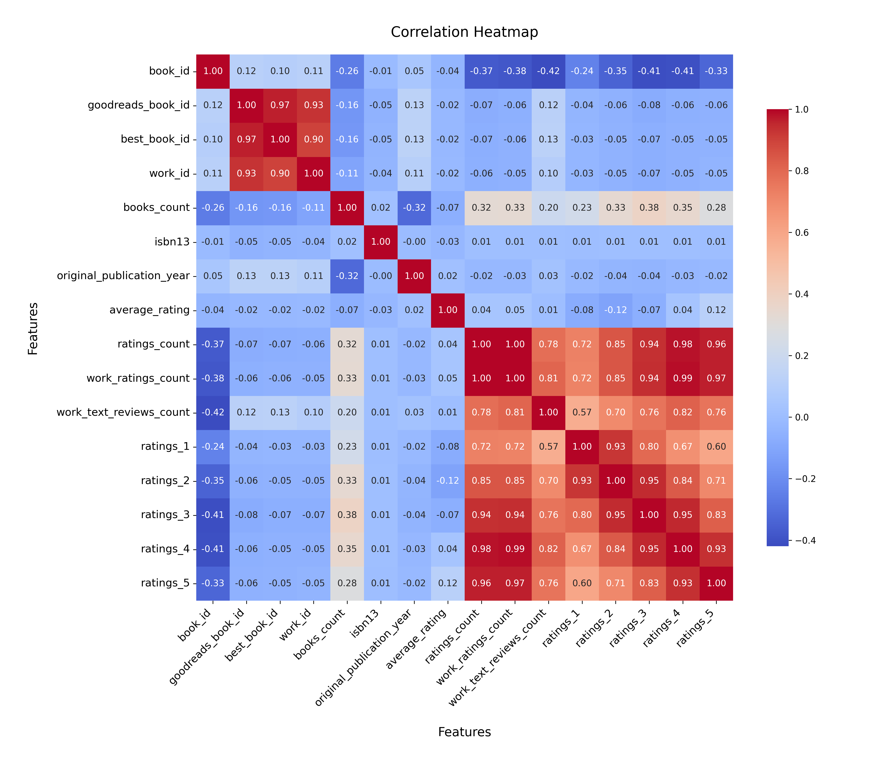
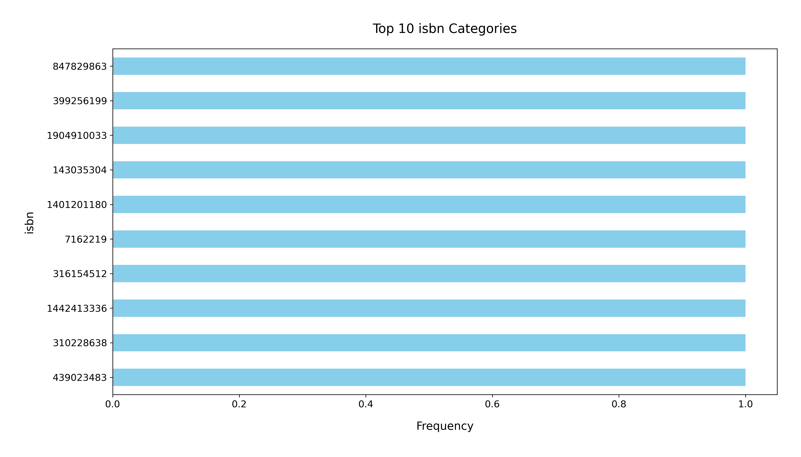

# Analysis Report

### Summary of the Goodreads Dataset

The dataset consists of 10,000 records and 23 columns, detailing various attributes of books listed on Goodreads. Key columns include identifiers for the books, authors, publication years, ratings, and counts of ratings and reviews. 

#### Key Insights

1. **Missing Values**: 
   - The dataset has several columns with missing values. Notably, the `isbn` and `isbn13` columns have 700 and 585 missing entries, respectively. Additionally, `original_publication_year` has 21 missing values, which may impact analysis related to publication trends.
   - The `language_code` has 1,084 missing values, indicating a potential area of concern for books with unspecified languages.

2. **Authors**:
   - The dataset includes 4,664 unique authors, with Stephen King being the most frequently mentioned, appearing 60 times. This highlights the popularity of certain authors and could indicate a bias towards well-known writers in the dataset.

3. **Publication Trends**: 
   - The average original publication year is approximately 1982, with a minimum year of -1750 and a maximum of 2017. This suggests a broad range of publication dates, but the concentration is likely towards more contemporary works.

4. **Ratings**:
   - The average rating across all books is 4.00, with a standard deviation of 0.25, indicating that most books are rated positively.
   - The ratings count and work ratings count have mean values of 54,001 and 59,687, respectively. This suggests a significant level of engagement with the books, which is promising for community interaction.

5. **Language Distribution**: 
   - The top language code is English (eng), which signifies that the dataset may predominantly represent English-language books. This could limit insights into global literature diversity.

6. **ISBN Information**: 
   - A considerable number of books lack ISBNs, which can complicate the identification and cataloging of works. 

7. **Visualizations**: 
   - A histogram of average ratings may reveal the distribution of ratings across books, indicating whether most ratings cluster around a specific value or vary widely.
   - A bar chart showing the count of books by language could illustrate the diversity of languages represented in the dataset.

### Recommendations

1. **Address Missing Values**: 
   - Implement strategies to handle missing values, especially in critical columns like `isbn`, `isbn13`, and `original_publication_year`. Imputation or removal of affected rows may be necessary depending on analysis goals.

2. **Focus on Diversity**: 
   - Expand the dataset to include a broader range of languages and authors, particularly from underrepresented regions, to gain a more complete picture of global literature.

3. **Engage with Popular Authors**: 
   - Analyze the works of popular authors like Stephen King further to understand trends in their ratings and explore similarities among their works.

4. **Publication Year Analysis**: 
   - Conduct a temporal analysis of the original publication year to identify trends in publishing and reader engagement over time.

5. **Explore Reader Engagement**: 
   - Investigate correlations between ratings, reviews, and authorship to determine what factors contribute most to reader satisfaction.

By addressing these recommendations, further insights can be garnered from the dataset, improving understanding of reader preferences and trends within the literary community.

